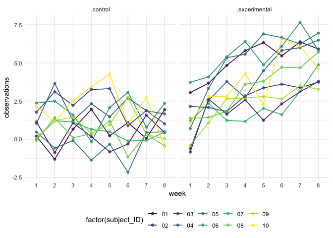

p8105\_hw5\_xm2276
================
XIAO MA
11/20/2021

``` r
library(tidyverse)
library(rvest)
library(knitr)
library(ggplot2)
theme_set(theme_minimal() +  theme(legend.position = "bottom"))

options(
  ggplots2.continuous.color = "viridis",
  ggplots2.continuous.fill = "viridus"
)

scale_colour_discrete = scale_colour_viridis_d
scale_fill_discrete = scale_fill_viridis_d
```

# Problem 1

``` r
homicide_url = "https://raw.githubusercontent.com/washingtonpost/data-homicides/master/homicide-data.csv"
homicide_df = read_csv(homicide_url)
```

    ## Rows: 52179 Columns: 12

    ## ── Column specification ────────────────────────────────────────────────────────
    ## Delimiter: ","
    ## chr (9): uid, victim_last, victim_first, victim_race, victim_age, victim_sex...
    ## dbl (3): reported_date, lat, lon

    ## 
    ## ℹ Use `spec()` to retrieve the full column specification for this data.
    ## ℹ Specify the column types or set `show_col_types = FALSE` to quiet this message.

The dimention of the data is 52179, 12

``` r
city_state_homi = homicide_df %>% 
  unite(city_state, c("city", "state"), sep = ", ") %>% 
  group_by(city_state) %>% 
  summarize(total_homic = n(),
            total_unsolved = sum(disposition %in% c("Closed without arrest", "Open/No arrest")))

knitr::kable(city_state_homi)
```

| city\_state        | total\_homic | total\_unsolved |
|:-------------------|-------------:|----------------:|
| Albuquerque, NM    |          378 |             146 |
| Atlanta, GA        |          973 |             373 |
| Baltimore, MD      |         2827 |            1825 |
| Baton Rouge, LA    |          424 |             196 |
| Birmingham, AL     |          800 |             347 |
| Boston, MA         |          614 |             310 |
| Buffalo, NY        |          521 |             319 |
| Charlotte, NC      |          687 |             206 |
| Chicago, IL        |         5535 |            4073 |
| Cincinnati, OH     |          694 |             309 |
| Columbus, OH       |         1084 |             575 |
| Dallas, TX         |         1567 |             754 |
| Denver, CO         |          312 |             169 |
| Detroit, MI        |         2519 |            1482 |
| Durham, NC         |          276 |             101 |
| Fort Worth, TX     |          549 |             255 |
| Fresno, CA         |          487 |             169 |
| Houston, TX        |         2942 |            1493 |
| Indianapolis, IN   |         1322 |             594 |
| Jacksonville, FL   |         1168 |             597 |
| Kansas City, MO    |         1190 |             486 |
| Las Vegas, NV      |         1381 |             572 |
| Long Beach, CA     |          378 |             156 |
| Los Angeles, CA    |         2257 |            1106 |
| Louisville, KY     |          576 |             261 |
| Memphis, TN        |         1514 |             483 |
| Miami, FL          |          744 |             450 |
| Milwaukee, wI      |         1115 |             403 |
| Minneapolis, MN    |          366 |             187 |
| Nashville, TN      |          767 |             278 |
| New Orleans, LA    |         1434 |             930 |
| New York, NY       |          627 |             243 |
| Oakland, CA        |          947 |             508 |
| Oklahoma City, OK  |          672 |             326 |
| Omaha, NE          |          409 |             169 |
| Philadelphia, PA   |         3037 |            1360 |
| Phoenix, AZ        |          914 |             504 |
| Pittsburgh, PA     |          631 |             337 |
| Richmond, VA       |          429 |             113 |
| Sacramento, CA     |          376 |             139 |
| San Antonio, TX    |          833 |             357 |
| San Bernardino, CA |          275 |             170 |
| San Diego, CA      |          461 |             175 |
| San Francisco, CA  |          663 |             336 |
| Savannah, GA       |          246 |             115 |
| St. Louis, MO      |         1677 |             905 |
| Stockton, CA       |          444 |             266 |
| Tampa, FL          |          208 |              95 |
| Tulsa, AL          |            1 |               0 |
| Tulsa, OK          |          583 |             193 |
| Washington, DC     |         1345 |             589 |

``` r
balti = city_state_homi %>% 
      filter(city_state == "Baltimore, MD") 
prop_test_balti = 
      prop.test(x = pull(balti, total_unsolved),
                n = pull(balti, total_homic)) %>% 
      broom::tidy() %>% 
      select(estimate, conf.low, conf.high)
    
    
homicide_cities =
  city_state_homi %>% 
  mutate(prop_test = map2(.x = total_unsolved, .y = total_homic, 
                          ~prop.test(x = .x, n = .y)),
         tidy_test = map(.x = prop_test, ~broom::tidy(.x))) %>% 
  select(-prop_test) %>% 
  unnest(tidy_test) %>%
  select(city_state, estimate, conf.low, conf.high)


homicide_cities %>% 
  mutate(city_state = fct_reorder(city_state,estimate)) %>%
  ggplot(aes(x = city_state, 
             y = estimate)) + 
  geom_point() +
  geom_errorbar(aes(ymin = conf.low, ymax = conf.high)) +
  coord_flip() +
   theme(axis.text.x = element_text(angle = 90, vjust = 0.5, hjust = 0.5))
```

<!-- -->

# Problem 2

``` r
data_p2 = str_c("data/", list.files(path = "data/."))


data_p2_tidy = tibble(path = list.files("data/.")) %>% 
      mutate(
        path = str_c("data/.", path),
        data = purrr::map(data_p2, ~ read_csv(.x))) %>% 
        unnest(data) %>% 
      separate(path, into = c("path", "other"), sep = "/") %>% 
      separate(other, into = c("arm", "rest"), sep = "_") %>% 
      separate(rest, into = c("subject_ID", "remain"), sep = 2) %>% 
      select(-path, -remain) %>% 
        pivot_longer(
        week_1:week_8,
        names_to = "time",
        values_to = "observations"
        ) %>% 
      mutate(
        arm = str_replace(arm, "con", "control"),
        arm = str_replace(arm, "exp", "experimental")
      ) %>% 
      separate(time, into = c("name", "week"), sep = "_") %>% 
      select(-name)
```

    ## Rows: 1 Columns: 8

    ## ── Column specification ────────────────────────────────────────────────────────
    ## Delimiter: ","
    ## dbl (8): week_1, week_2, week_3, week_4, week_5, week_6, week_7, week_8

    ## 
    ## ℹ Use `spec()` to retrieve the full column specification for this data.
    ## ℹ Specify the column types or set `show_col_types = FALSE` to quiet this message.

    ## Rows: 1 Columns: 8

    ## ── Column specification ────────────────────────────────────────────────────────
    ## Delimiter: ","
    ## dbl (8): week_1, week_2, week_3, week_4, week_5, week_6, week_7, week_8

    ## 
    ## ℹ Use `spec()` to retrieve the full column specification for this data.
    ## ℹ Specify the column types or set `show_col_types = FALSE` to quiet this message.

    ## Rows: 1 Columns: 8

    ## ── Column specification ────────────────────────────────────────────────────────
    ## Delimiter: ","
    ## dbl (8): week_1, week_2, week_3, week_4, week_5, week_6, week_7, week_8

    ## 
    ## ℹ Use `spec()` to retrieve the full column specification for this data.
    ## ℹ Specify the column types or set `show_col_types = FALSE` to quiet this message.

    ## Rows: 1 Columns: 8

    ## ── Column specification ────────────────────────────────────────────────────────
    ## Delimiter: ","
    ## dbl (8): week_1, week_2, week_3, week_4, week_5, week_6, week_7, week_8

    ## 
    ## ℹ Use `spec()` to retrieve the full column specification for this data.
    ## ℹ Specify the column types or set `show_col_types = FALSE` to quiet this message.

    ## Rows: 1 Columns: 8

    ## ── Column specification ────────────────────────────────────────────────────────
    ## Delimiter: ","
    ## dbl (8): week_1, week_2, week_3, week_4, week_5, week_6, week_7, week_8

    ## 
    ## ℹ Use `spec()` to retrieve the full column specification for this data.
    ## ℹ Specify the column types or set `show_col_types = FALSE` to quiet this message.

    ## Rows: 1 Columns: 8

    ## ── Column specification ────────────────────────────────────────────────────────
    ## Delimiter: ","
    ## dbl (8): week_1, week_2, week_3, week_4, week_5, week_6, week_7, week_8

    ## 
    ## ℹ Use `spec()` to retrieve the full column specification for this data.
    ## ℹ Specify the column types or set `show_col_types = FALSE` to quiet this message.

    ## Rows: 1 Columns: 8

    ## ── Column specification ────────────────────────────────────────────────────────
    ## Delimiter: ","
    ## dbl (8): week_1, week_2, week_3, week_4, week_5, week_6, week_7, week_8

    ## 
    ## ℹ Use `spec()` to retrieve the full column specification for this data.
    ## ℹ Specify the column types or set `show_col_types = FALSE` to quiet this message.

    ## Rows: 1 Columns: 8

    ## ── Column specification ────────────────────────────────────────────────────────
    ## Delimiter: ","
    ## dbl (8): week_1, week_2, week_3, week_4, week_5, week_6, week_7, week_8

    ## 
    ## ℹ Use `spec()` to retrieve the full column specification for this data.
    ## ℹ Specify the column types or set `show_col_types = FALSE` to quiet this message.

    ## Rows: 1 Columns: 8

    ## ── Column specification ────────────────────────────────────────────────────────
    ## Delimiter: ","
    ## dbl (8): week_1, week_2, week_3, week_4, week_5, week_6, week_7, week_8

    ## 
    ## ℹ Use `spec()` to retrieve the full column specification for this data.
    ## ℹ Specify the column types or set `show_col_types = FALSE` to quiet this message.

    ## Rows: 1 Columns: 8

    ## ── Column specification ────────────────────────────────────────────────────────
    ## Delimiter: ","
    ## dbl (8): week_1, week_2, week_3, week_4, week_5, week_6, week_7, week_8

    ## 
    ## ℹ Use `spec()` to retrieve the full column specification for this data.
    ## ℹ Specify the column types or set `show_col_types = FALSE` to quiet this message.

    ## Rows: 1 Columns: 8

    ## ── Column specification ────────────────────────────────────────────────────────
    ## Delimiter: ","
    ## dbl (8): week_1, week_2, week_3, week_4, week_5, week_6, week_7, week_8

    ## 
    ## ℹ Use `spec()` to retrieve the full column specification for this data.
    ## ℹ Specify the column types or set `show_col_types = FALSE` to quiet this message.

    ## Rows: 1 Columns: 8

    ## ── Column specification ────────────────────────────────────────────────────────
    ## Delimiter: ","
    ## dbl (8): week_1, week_2, week_3, week_4, week_5, week_6, week_7, week_8

    ## 
    ## ℹ Use `spec()` to retrieve the full column specification for this data.
    ## ℹ Specify the column types or set `show_col_types = FALSE` to quiet this message.

    ## Rows: 1 Columns: 8

    ## ── Column specification ────────────────────────────────────────────────────────
    ## Delimiter: ","
    ## dbl (8): week_1, week_2, week_3, week_4, week_5, week_6, week_7, week_8

    ## 
    ## ℹ Use `spec()` to retrieve the full column specification for this data.
    ## ℹ Specify the column types or set `show_col_types = FALSE` to quiet this message.

    ## Rows: 1 Columns: 8

    ## ── Column specification ────────────────────────────────────────────────────────
    ## Delimiter: ","
    ## dbl (8): week_1, week_2, week_3, week_4, week_5, week_6, week_7, week_8

    ## 
    ## ℹ Use `spec()` to retrieve the full column specification for this data.
    ## ℹ Specify the column types or set `show_col_types = FALSE` to quiet this message.

    ## Rows: 1 Columns: 8

    ## ── Column specification ────────────────────────────────────────────────────────
    ## Delimiter: ","
    ## dbl (8): week_1, week_2, week_3, week_4, week_5, week_6, week_7, week_8

    ## 
    ## ℹ Use `spec()` to retrieve the full column specification for this data.
    ## ℹ Specify the column types or set `show_col_types = FALSE` to quiet this message.

    ## Rows: 1 Columns: 8

    ## ── Column specification ────────────────────────────────────────────────────────
    ## Delimiter: ","
    ## dbl (8): week_1, week_2, week_3, week_4, week_5, week_6, week_7, week_8

    ## 
    ## ℹ Use `spec()` to retrieve the full column specification for this data.
    ## ℹ Specify the column types or set `show_col_types = FALSE` to quiet this message.

    ## Rows: 1 Columns: 8

    ## ── Column specification ────────────────────────────────────────────────────────
    ## Delimiter: ","
    ## dbl (8): week_1, week_2, week_3, week_4, week_5, week_6, week_7, week_8

    ## 
    ## ℹ Use `spec()` to retrieve the full column specification for this data.
    ## ℹ Specify the column types or set `show_col_types = FALSE` to quiet this message.

    ## Rows: 1 Columns: 8

    ## ── Column specification ────────────────────────────────────────────────────────
    ## Delimiter: ","
    ## dbl (8): week_1, week_2, week_3, week_4, week_5, week_6, week_7, week_8

    ## 
    ## ℹ Use `spec()` to retrieve the full column specification for this data.
    ## ℹ Specify the column types or set `show_col_types = FALSE` to quiet this message.

    ## Rows: 1 Columns: 8

    ## ── Column specification ────────────────────────────────────────────────────────
    ## Delimiter: ","
    ## dbl (8): week_1, week_2, week_3, week_4, week_5, week_6, week_7, week_8

    ## 
    ## ℹ Use `spec()` to retrieve the full column specification for this data.
    ## ℹ Specify the column types or set `show_col_types = FALSE` to quiet this message.

    ## Rows: 1 Columns: 8

    ## ── Column specification ────────────────────────────────────────────────────────
    ## Delimiter: ","
    ## dbl (8): week_1, week_2, week_3, week_4, week_5, week_6, week_7, week_8

    ## 
    ## ℹ Use `spec()` to retrieve the full column specification for this data.
    ## ℹ Specify the column types or set `show_col_types = FALSE` to quiet this message.

``` r
#get the plot
data_p2_tidy %>% 
     ggplot(aes(x = week, y = observations, group = subject_ID, color = factor(subject_ID))) +
      facet_grid(. ~ arm) +
   geom_path(alpha = 0.7) + 
  geom_point(alpha = 0.7) +
      geom_line() 
```

<!-- --> \#
From the plots, both the control and the experiment group are ups and
downs. From the overall trend, the viberation of observations of control
group are between -2.5 to 4, which does not change too much. But for the
experimental group, observations are increasing over time.

# Problem 3

``` r
set.seed(10)

iris_with_missing = iris %>% 
  map_df(~replace(.x, sample(1:150, 20), NA)) %>%
  mutate(Species = as.character(Species))

replace_func = function(x) {
  if (is.numeric(x)) {
   x = replace_na(x, mean(x, na.rm = TRUE))
    }
  else if (is.character(x)) {
    x = replace_na(x, "virginica")
  }
}
iris_with_missing_replace = map(iris_with_missing, replace_func)
iris = iris_with_missing_replace %>% 
  as_tibble()
iris
```

    ## # A tibble: 150 × 5
    ##    Sepal.Length Sepal.Width Petal.Length Petal.Width Species
    ##           <dbl>       <dbl>        <dbl>       <dbl> <chr>  
    ##  1         5.1          3.5         1.4         0.2  setosa 
    ##  2         4.9          3           1.4         0.2  setosa 
    ##  3         4.7          3.2         1.3         0.2  setosa 
    ##  4         4.6          3.1         1.5         1.19 setosa 
    ##  5         5            3.6         1.4         0.2  setosa 
    ##  6         5.4          3.9         1.7         0.4  setosa 
    ##  7         5.82         3.4         1.4         0.3  setosa 
    ##  8         5            3.4         1.5         0.2  setosa 
    ##  9         4.4          2.9         1.4         0.2  setosa 
    ## 10         4.9          3.1         3.77        0.1  setosa 
    ## # … with 140 more rows
